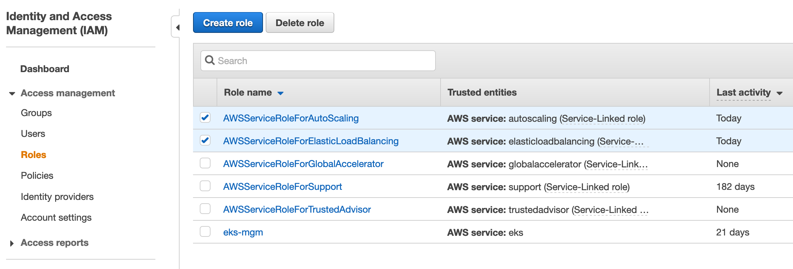
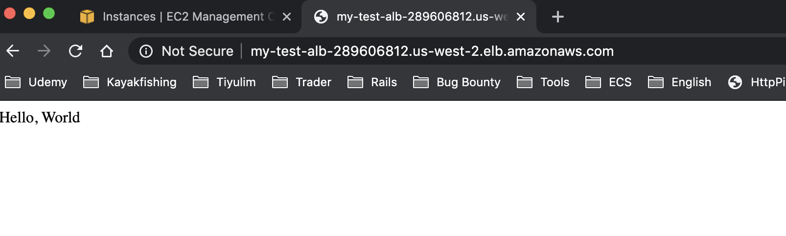
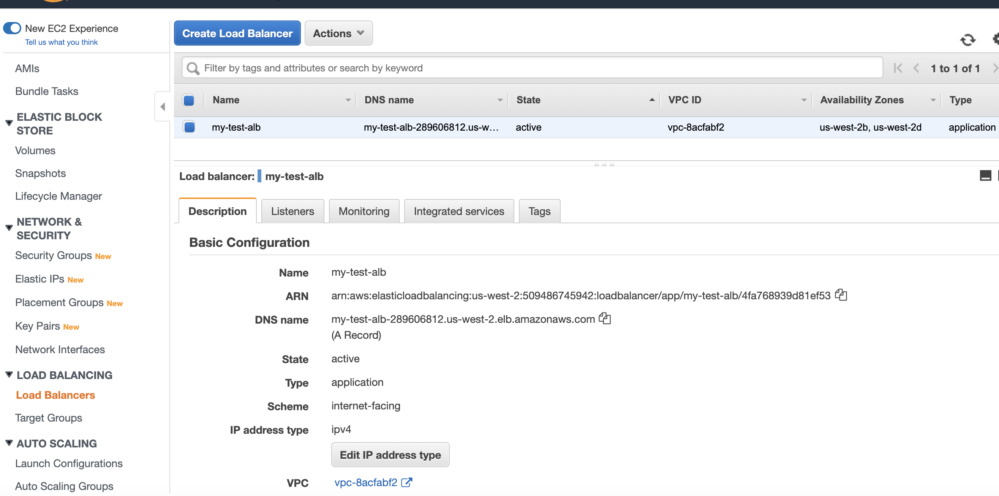
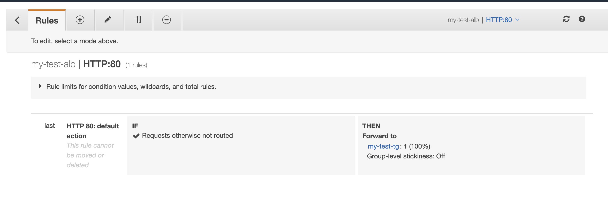
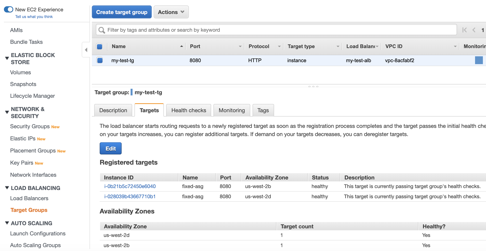
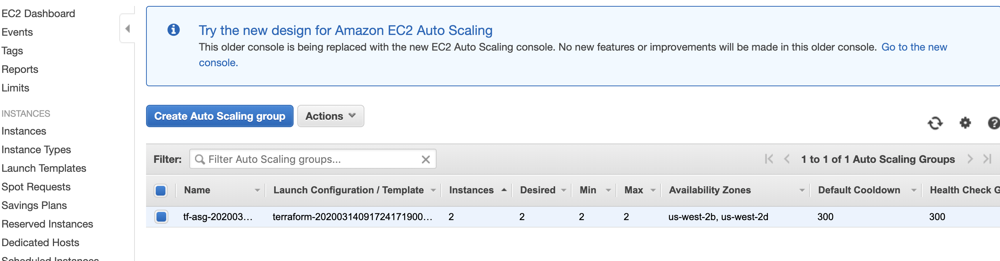
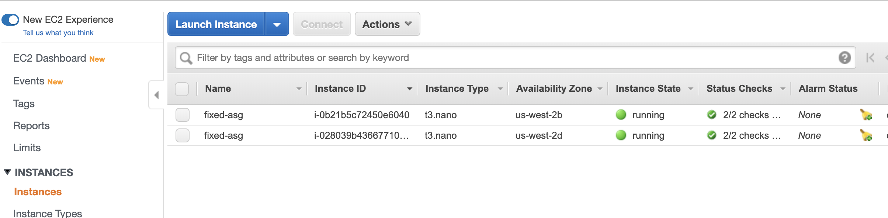

# Objective

Deploy a simple 'Hello World!' app on AWS with terraform and using Application Load Balancer(ALB) and Fixed Autoscaling Group

## Requirements

1. The website should display the text 'Hello World!'

2. The website should be exposed to the internet over HTTP

3. The website should run on 2 t3.nano EC2 instances using a fixed sized Auto Scaling group (ASG)

4. The website should utilize an EC2 application load balancer (ALB) to distribute traffic between the EC2 instances

5. The deployment using terraform

## Prerequisites

* Default "vpc_id" from your AWS account: Services->VPC->Your VPCs->VPC ID

* "subnet1" and "subnet2" from your AWS account: Services->VPC->Subnets->Subnet ID

*  "access_key" / "secret_key" for AWS provider, for this you need go to Services/IAM:
  
        Create User with 'AmazonEC2FullAccess' permissions.
  
		Be able to create the roles for ASG and ALB, you need permissions for you IAM user: AWSServiceRoleForAutoScaling / AWSServiceRoleForElasticLoadBalancing

## Hello world server

For 'Hello World' web app I am using simple BusyBox HTTP Daemon on port 8080, busybox exists for every ubuntu AMI, so no need to install anything, I am also using 'user data' inside of launch configuration to run BusyBox HTTP Daemon after provision:

	  user_data = <<-EOF
	  #!/bin/bash
	  echo "Hello, World" > index.html
	  nohup busybox httpd -f -p "${var.server_port}" &
	  EOF

Used busybox to simplify things, of course you can create with packer your AMI with your configuration and web app - python app for example.

## Things may be improved

* terraform.tfstate problem:
  
  The problem arrives when you are working in a team. Since terraform.tfstate file is created on your local file system the other developer does not have visibility to it. When any other developer executes the same scripts terraform will create a new terraform.tfstate file which would be different from the current state.

  Solution:
  1. Save terraform.tfstate in a source control
  2. Remote Backends - for example save tfstate in S3 bucket.

* Automate all process even more by adding new VPC + new subnetworks, problem here that I need public facing VPC + public subnetworks and for this I also need to add 'aws_nat_gateway' / 'aws_route_table' ..., I wanted to simplify all things instead.

## Bugs in terraform during development 

If subnet1/subnet2 from Prerequisites is for public ips - instances by default created with public ip and you using in 'aws_launch_configuration' -> 'associate_public_ip_address = false', it's not working and instances still assigned public ips.
It's terraform problem, only way to fix create network without default public ips.

## Screenshots

